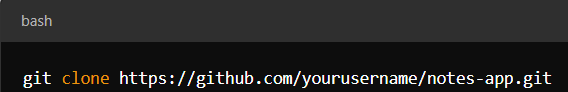
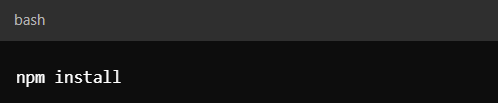
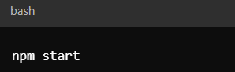

# ClarityNotes

A simple Express.js application that allows users to create, save,delete, and view notes. This project uses Express to handle HTTP requests and a JSON file to store the notes.

## Features

- Creates notes: Add new notes with a title and text.
- View Notes: Fetch and display all existing notes.

## Installation 

To get started with ClarityNotes, follow these steps below: 

- Ensure you have node.js installed. You can download it from nodejs.org.
- Node.js comes with npm. Verify the installation by running npm-v in your terminal.
- Clone the repository to your local machine.

- Navigate to the project directory and install the required dependencies

## Usage

- To start the server, run the following command: 

## Contributions 

If you'd like to contribute to the development of the Notes App, please fork the repository and submit a pull request with your changes.

- Fork the repository on GitHub.
- Create a new branch for your feature or bug fix.
- Commit your changes and push them to your forked repository.
- Submit a pull request detailing your changes.

## Links

Deployment Link: 

Repository Link: 

## License 

This project is licensed under MIT License. For more information please click on the badge below: 

 

